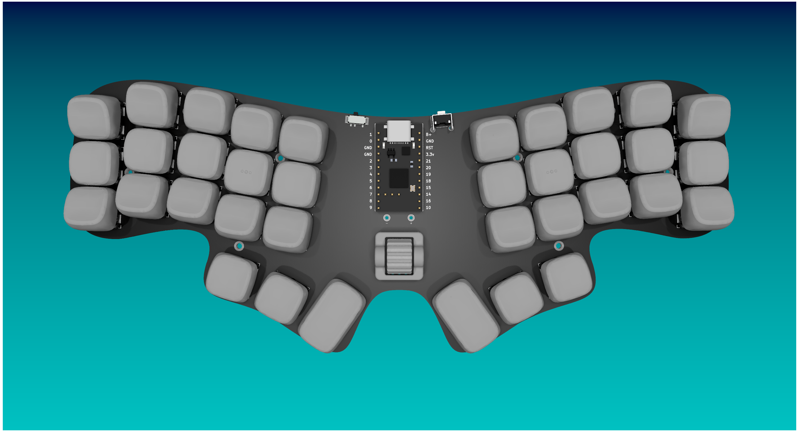
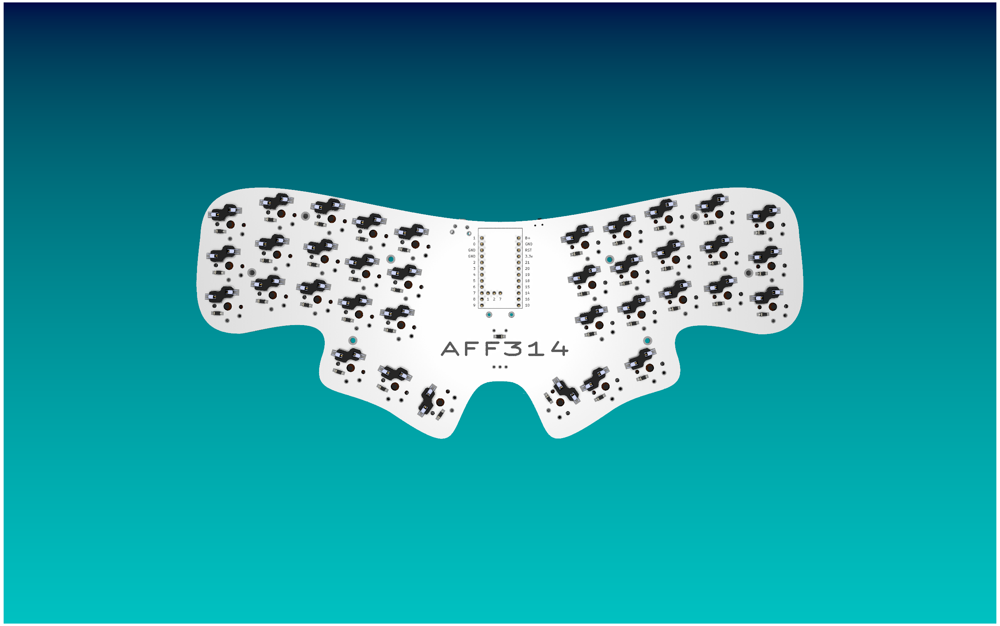
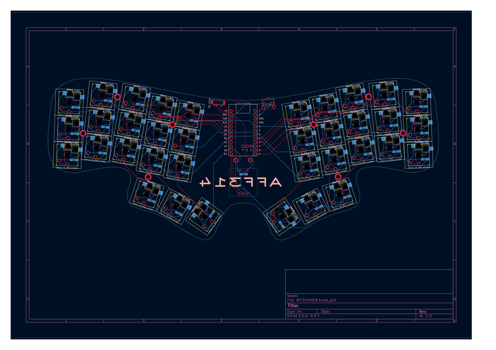

# AFF314KEEB
A wireless 36-key low profile non split ergo keyboard.

WIP

I started to make this project because I really like using those 36-key boards and I've even built two and a handwired board which I designed myself, but never somthing this well thought out with a pcb and everything. I'm really intersted in those kinds of projects and really like the ones others made but I never did one on my own. 

I if you ever want to rebulid or modify the board feel free to do that, but you should probably wait until I've actually tested if every thing works.

## Intructions on buildung your own
If you want to build your own AFF314KEEB you should start to download the [Gerber file](PCB/Gerber.zip) and upload it to your prefered PCB manufacturing service and order it from there with the PCB from the CKW12 which you can find [here](https://github.com/kumamuk-git/CKW12).

You can find the rest of the parts in the [BOM](BOM.csv).

Once you have sourced all the parts you have to follow the [build guide](BUILDGUIDE.md).

