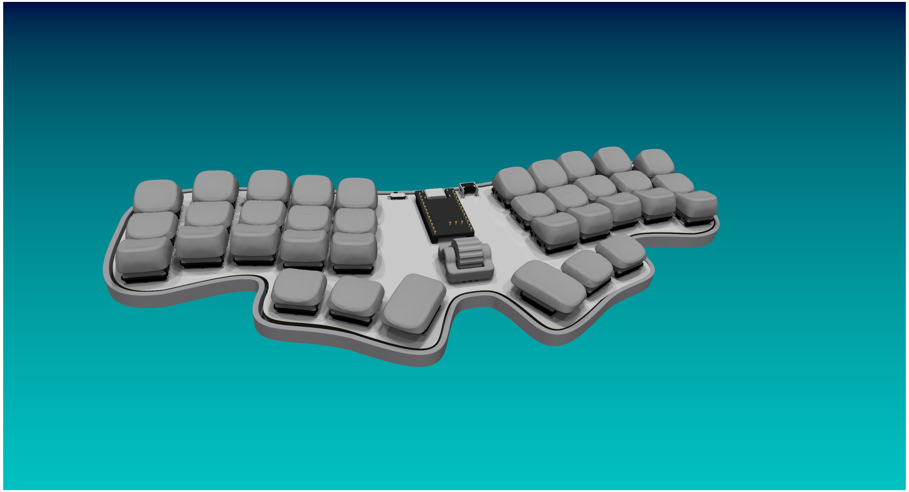

# AFF314KEEB
A wireless 36-key low profile non split ergo keyboard.

I started to make this project because I really like using 36-key boards and I've even built two and a handwired board which I designed myself, but never somthing with a PCB. I'm really intersted in those kinds of projects and really like the ones others made but I've never really did one of my own. In the process of designing the board I've learned a lot on how to use KiCad and for the first time I actually documented what I was doing.

I want to thank [Joe Scotto](https://github.com/joe-scotto) for the KiCad footprints and symbols and for the great tutorials on designing a keyboard case and on ZMK.

Additionally I want to thank [GEIST](https://github.com/GEIGEIGEIST) for the Kicad footprints.

And lastly I want to thank [Kumamuk](https://github.com/kumamuk-git) for the CKW12 which made having a roller encoder possible since the EVQWGD001 is way too expensive.

## Instructions on buildung your own
If you want to build your own AFF314KEEB you should start to download the [Gerber file](PCB/Gerber.zip) and upload it to your prefered PCB manufacturing service and order it from there with the PCB from the CKW12 which you can find [here](https://github.com/kumamuk-git/CKW12).

You can find the rest of the parts in the [BOM](BOM.csv).

Once you have sourced all the parts you have to follow the [build guide](BUILDGUIDE.md).

## Partlist

Since I'm from Germany the prices were in EUR and I converted them to USD. Therefore they might not be one hundred percent accurate.

### Parts for the AFF314KEEB

| Item | Qty. | Total Price in USD | Link |
|------|------|--------------------|------|
| NRF52840 NineNano v2 Clone | 1 | 3.77 | https://de.aliexpress.com/item/1005006271779544.html |
| Kailh Choc Hot-Swap Socket | 36 | 6.25 | https://de.aliexpress.com/item/1005008928238101.html |
| Kailh Choc V1 Switch | 36 | 34.24 | https://de.aliexpress.com/item/1005008701630340.html |
| 1N4148W SOD123 | 37 | 1.64 | https://de.aliexpress.com/item/1005006123061230.html |
| IC-Sockets | 2 | 1.76 | https://de.aliexpress.com/item/1005007476809536.html |
| 3.7 V 301230 | 1 | 6.83 | https://ampul.eu/de/batterie/5763-li-polymer-akku-110mah-37v-301230-ph2-2pin |
| SKHLLCA010 | 1 | 0.71 | https://keeb.supply/products/alps-reset-button?variant=e834d428-bed6-4fb3-b94a-90e8f8b87d9b |
| MillMax Pins 3320-0-00-15-00-00-03-0 (optional) | 24 | 3.78 | https://keeb.supply/products/millmax-pins?variant=29bd2804-2a61-4fea-bfe3-f96557a35bd5 |
| PCB | 1 | 14.31 | https://github.com/Aff314/AFF314KEEB/blob/main/PCB/Gerber.zip |
| Any Keycaps for Choc V1 | 36 |  | https://github.com/braindefender/KLP-Lame-Keycaps/tree/master/STEP/Choc%20Stem%20%2B%20Choc%20Size |
| 3D Printed Case | 1 |  | https://github.com/Aff314/AFF314KEEB/tree/main/Case |
| Heatseat insert M2x3x3.5 | 8 | 2.54 | https://de.aliexpress.com/item/1005010362011631.html |

### Parts for the CKW12

| Item | Qty. | Total Price in USD | Link |
|------|------|--------------------|------|
| SMD 3x6x2.5MM Tactile Button | 1 | 1.10 | https://de.aliexpress.com/item/1005008818216326.html |
| EC05E1220202 | 1 | 31.12 | https://de.aliexpress.com/item/1005007146553579.html |
| PCB | 1 | 2.40 | https://github.com/kumamuk-git/CKW12/tree/main/pcb/top |
| 3D Printed Housing | 1 |  | https://github.com/kumamuk-git/CKW12/blob/main/3dmodel/ckw12_housing.stp |
| 3D Printed Stem | 1 |  | https://github.com/kumamuk-git/CKW12/blob/main/3dmodel/ckw12_stem.stl |
| 3D Printed Wheel | 1 |  | https://github.com/kumamuk-git/CKW12/blob/main/3dmodel/ckw12_wheel_fix.stp |
